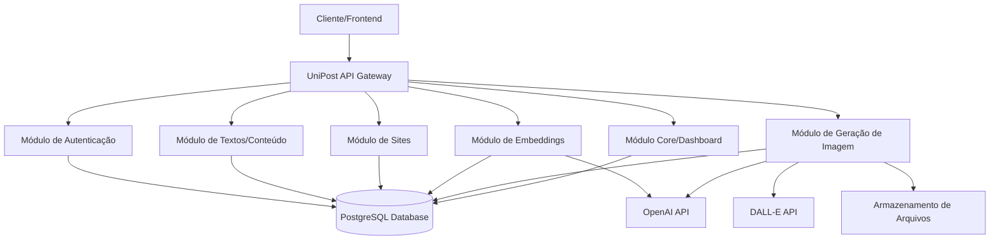
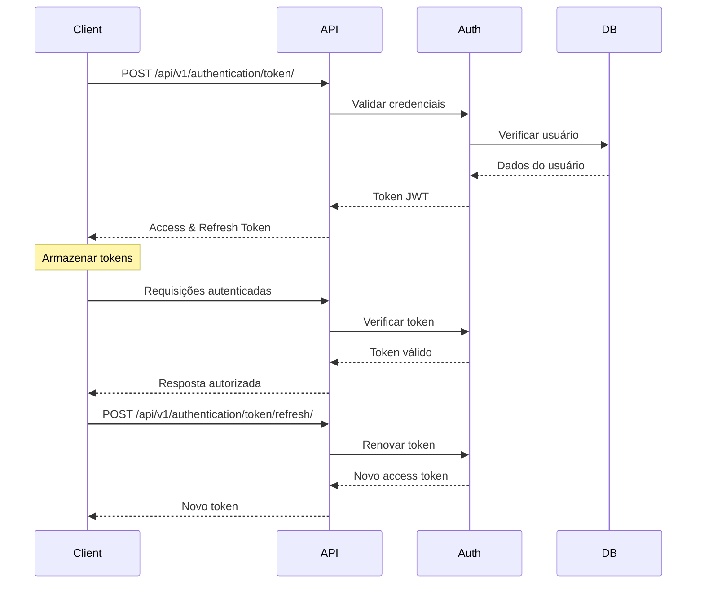
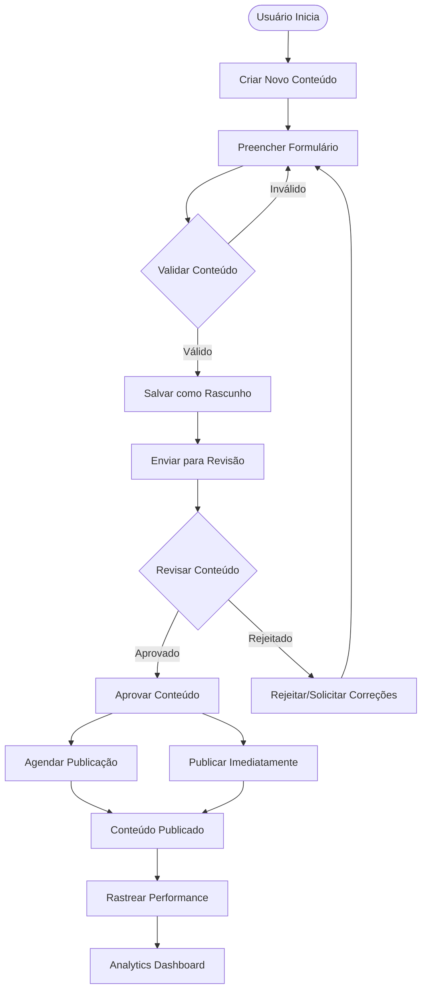
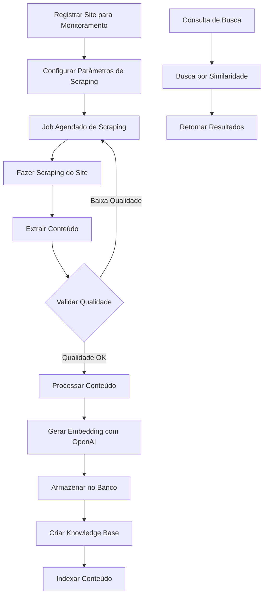
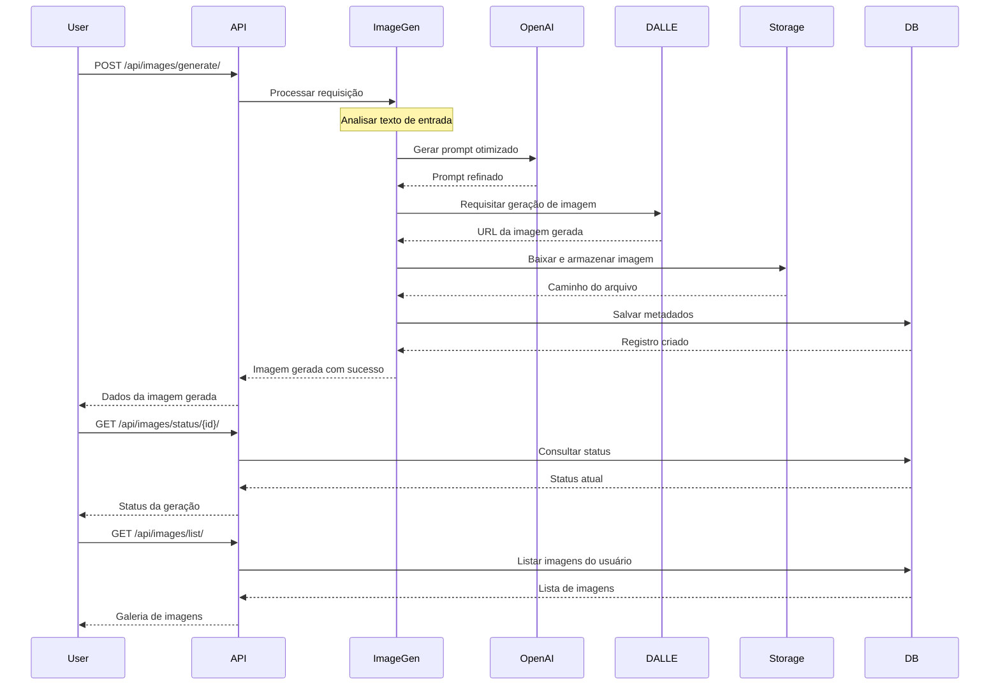
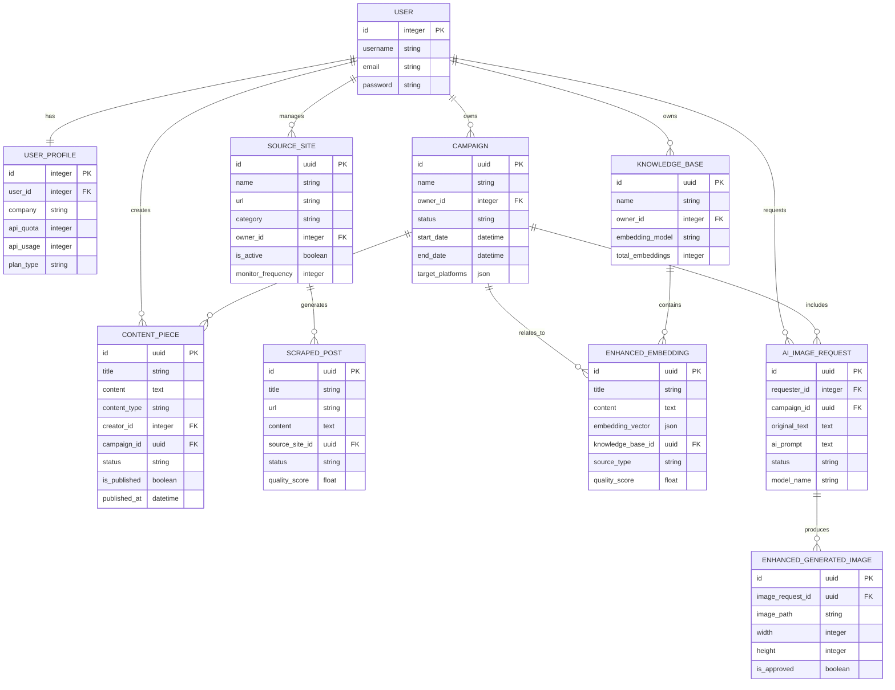
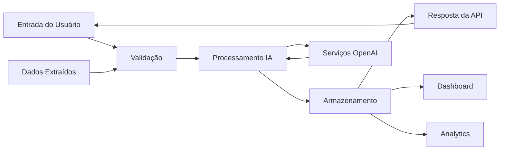

# UniPost API - Fluxo de Dados e Funcionalidades

Este documento descreve o fluxo de dados da UniPost API em formato Mermaid para geração de diagramas.

## Visão Geral da Arquitetura

## Fluxo de Autenticação

## Fluxo de Gerenciamento de Conteúdo

## Fluxo de Web Scraping e Embeddings

## Fluxo de Geração de Imagens

## Estrutura de Dados e Relacionamentos

## Endpoints da API por Módulo

### Autenticação (`/api/v1/authentication/`)
- `POST /token/` - Obter token de acesso
- `POST /token/refresh/` - Renovar token
- `POST /token/verify/` - Verificar token
- `POST /logout/` - Logout
- `GET /user/permissions/` - Obter permissões do usuário

### Conteúdo (`/api/v1/texts/`)
- `GET /` - Listar conteúdos
- `POST /` - Criar novo conteúdo
- `GET /{id}/` - Obter conteúdo específico
- `PUT /{id}/` - Atualizar conteúdo
- `DELETE /{id}/` - Deletar conteúdo
- `POST /webhook/approval/` - Webhook de aprovação

### Sites (`/api/v1/sites/`)
- `GET /` - Listar sites
- `POST /` - Registrar novo site
- `GET /{id}/` - Obter detalhes do site
- `PUT /{id}/` - Atualizar configurações do site
- `DELETE /{id}/` - Remover site

### Embeddings (`/api/v1/embeddings/`)
- `GET /` - Listar embeddings
- `POST /` - Criar embedding
- `GET /{id}/` - Obter embedding específico
- `PUT /{id}/` - Atualizar embedding
- `DELETE /{id}/` - Deletar embedding

### Core/Dashboard (`/api/v1/`)
- `GET /dashboard/analytics/` - Analytics do dashboard
- `GET /admin/system/health/` - Saúde do sistema
- `GET /admin/audit/logs/` - Logs de auditoria

### Geração de Imagens (`/api/images/`)
- `POST /generate/` - Gerar nova imagem
- `GET /status/{id}/` - Status da geração
- `GET /list/` - Listar imagens geradas

## Fluxo de Dados Completo

---

Este documento fornece uma visão completa do fluxo de dados da UniPost API, incluindo todos os módulos principais, suas interações e os fluxos de dados entre eles. Os diagramas podem ser renderizados usando qualquer ferramenta compatível com Mermaid.