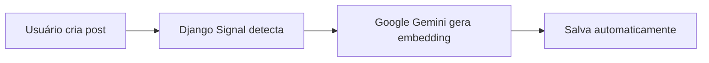
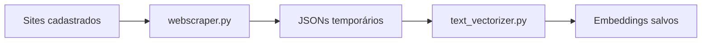
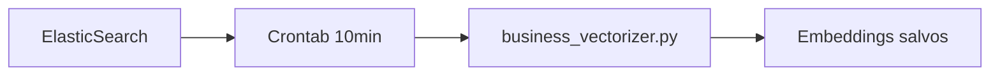

# Sistema de Embeddings - UniPost API

Sistema avançado de **inteligência artificial** e **busca semântica** para gerenciamento e vetorização automática de conteúdo.

## 🤖 Visão Geral

O sistema de embeddings do UniPost API utiliza **Google Gemini** para converter texto em vetores matemáticos (embeddings) de alta dimensionalidade, permitindo:

- **Busca semântica**: Encontrar conteúdo por significado, não apenas palavras-chave
- **Análise de similaridade**: Identificar conteúdo relacionado automaticamente  
- **Categorização inteligente**: Agrupar conteúdo por contexto e tema
- **Recomendações**: Sugerir conteúdo relevante baseado em similaridade

## 📊 Origens de Embeddings

### 1. 🌐 **WebScraping** (`origin="webscraping"`)
- **Fonte**: Sites de referência cadastrados no modelo `Site`
- **Processo**: `webscraper.py` → `text_vectorizer.py` → Banco
- **Frequência**: Manual ou agendada
- **Metadados**: URL, categoria, data de scraping

### 2. ✍️ **Generated** (`origin="generated"`)  
- **Fonte**: Posts criados pelos usuários no modelo `Text`
- **Processo**: **Automático via Django Signal**
- **Frequência**: **Instantâneo** (ao criar/atualizar post)
- **Metadados**: Plataforma, tema, ID do texto, aprovação

### 3. 🧠 **Business Brain** (`origin="business_brain"`)
- **Fonte**: Dados corporativos do ElasticSearch externo
- **Processo**: `business_vectorizer.py` via **crontab (10 minutos)**
- **Frequência**: **Automática** e contínua
- **Metadados**: Índice ES, documento ID, score

## 🗄️ Modelo de Dados

### Estrutura do Embedding

```python
class Embedding(models.Model):
    id = models.UUIDField(primary_key=True)           # UUID único
    origin = models.CharField(max_length=20)          # Origem dos dados
    content = models.TextField()                      # Texto original
    title = models.CharField(max_length=500)          # Título descritivo
    embedding_vector = models.JSONField()             # Vetor Gemini (1536 dim)
    metadata = models.JSONField(default=dict)         # Metadados enriquecidos
    created_at = models.DateTimeField(auto_now_add=True)
    updated_at = models.DateTimeField(auto_now=True)
```

### Escolhas de Origem

```python
ORIGIN_CHOICES = (
    ('webscraping', 'WebScraping'),      # Sites externos
    ('generated', 'Generated'),          # Posts dos usuários  
    ('business_brain', 'Business Brain') # ElasticSearch corporativo
)
```

## 🔄 Fluxos de Vetorização

### Fluxo 1: Posts de Usuário (Automático)



**Processo detalhado:**
1. Usuário cria/atualiza post no modelo `Text`
2. Signal `post_save` é disparado automaticamente
3. Função `create_embedding_on_text_save` é executada
4. Google Gemini gera embedding do conteúdo
5. Embedding é salvo com `origin="generated"`

### Fluxo 2: Web Scraping (Manual/Agendado)



**Processo detalhado:**
1. Admin cadastra sites de referência
2. `webscraper.py` coleta conteúdo usando MCP
3. Dados salvos em JSONs temporários
4. `text_vectorizer.py` processa JSONs
5. Gera embeddings e salva com `origin="webscraping"`
6. JSONs são removidos após processamento

### Fluxo 3: Business Brain (Automático)



**Processo detalhado:**
1. Crontab executa a cada 10 minutos
2. `business_vectorizer.py` conecta no ElasticSearch
3. Descobre todos os índices automaticamente
4. Processa apenas documentos novos (incremental)
5. Gera embeddings e salva com `origin="business_brain"`

## 🛠️ Configuração e Uso

### Pré-requisitos

```env
# Google Gemini API Key (obrigatório)
GOOGLE_GEMINI_API_KEY=sua_chave_google_gemini

# ElasticSearch (opcional - para Business Brain)
ELASTICSEARCH_HOST=localhost
ELASTICSEARCH_PORT=9200
ELASTICSEARCH_USERNAME=
ELASTICSEARCH_PASSWORD=
```

### Instalação

```bash
# Dependências já incluídas no requirements.txt
pip install google-generativeai==0.8.3
pip install elasticsearch==8.16.0
pip install pgvector==0.4.1

# PostgreSQL com pgvector
docker-compose up -d  # Já configurado no projeto
```

## 📚 API REST

### Listar Embeddings

```http
GET /api/v1/embeddings/
Authorization: Bearer seu_token

# Filtros disponíveis (query parameters):
?origin=webscraping     # Apenas web scraping
?origin=generated       # Apenas posts de usuários  
?origin=business_brain  # Apenas dados corporativos
```

### Visualizar Embedding Específico

```http
GET /api/v1/embeddings/{uuid}/
Authorization: Bearer seu_token
```

**Resposta exemplo:**
```json
{
  "id": "550e8400-e29b-41d4-a716-446655440000",
  "origin": "generated",
  "content": "Conteúdo do post sobre marketing digital...",
  "title": "Facebook: Marketing Digital",
  "embedding_vector": [0.123, -0.456, 0.789, ...],
  "metadata": {
    "platform": "FCB",
    "platform_display": "Facebook",
    "theme": "Marketing Digital", 
    "text_id": 42,
    "is_approved": true,
    "auto_generated": true,
    "signal_triggered": true
  },
  "created_at": "2025-01-01T10:00:00Z",
  "updated_at": "2025-01-01T10:00:00Z"
}
```

### Criar Embedding Manual (Raro)

```http
POST /api/v1/embeddings/
Authorization: Bearer seu_token
Content-Type: application/json

{
  "origin": "webscraping",
  "content": "Texto para vetorizar...",
  "title": "Título descritivo",
  "embedding_vector": [/* vetor de 1536 dimensões */],
  "metadata": {
    "custom_field": "valor"
  }
}
```

## 🔍 Monitoramento e Analytics

### Verificar Status dos Embeddings

```bash
python manage.py shell

>>> from embeddings.models import Embedding
>>> from django.db.models import Count

# Contar por origem
>>> Embedding.objects.values('origin').annotate(count=Count('id'))
[{'origin': 'webscraping', 'count': 150},
 {'origin': 'generated', 'count': 89}, 
 {'origin': 'business_brain', 'count': 1247}]

# Últimos embeddings criados
>>> Embedding.objects.order_by('-created_at')[:5]

# Embeddings por período
>>> from datetime import datetime, timedelta
>>> yesterday = datetime.now() - timedelta(days=1)
>>> Embedding.objects.filter(created_at__gte=yesterday).count()
```

### Logs e Monitoramento

```bash
# Logs dos Django Signals (posts automáticos)
tail -f logs/django.log | grep "create_embedding_on_text_save"

# Logs de web scraping
tail -f scraping/vectorizer.log

# Logs do Business Brain
tail -f brain/business_brain.log

# Todos os logs de embeddings
find . -name "*.log" -exec grep -l "embedding" {} \;
```

## ⚙️ Configurações Avançadas

### Django Signals (Auto-vetorização)

Localização: `texts/signals.py`

```python
# Configurações do signal
@receiver(post_save, sender=Text)
def create_embedding_on_text_save(sender, instance, created, **kwargs):
    # Só processa se foi criado OU atualizado e aprovado
    should_process = created or (not created and instance.is_approved)
    
    # Evita duplicatas
    existing_embedding = Embedding.objects.filter(
        origin='generated',
        metadata__text_id=instance.id
    ).first()
```

### Chunking de Texto

Para textos grandes, o sistema divide automaticamente:

```python
# Configuração em text_vectorizer.py
chunk_size = 1000      # caracteres por chunk
overlap = 100          # sobreposição entre chunks
max_text_length = 2048 # limite da API Gemini
```

### Metadados por Origem

#### WebScraping
```json
{
  "site_name": "TechCrunch",
  "site_url": "https://techcrunch.com",
  "category": "NOTICIAS", 
  "scraped_at": "2025-01-01T10:00:00Z",
  "chunk_index": 0,
  "total_chunks": 1,
  "processed_at": "2025-01-01T10:05:00Z"
}
```

#### Generated (Posts)
```json
{
  "platform": "FCB",
  "platform_display": "Facebook",
  "theme": "Marketing Digital",
  "text_id": 42,
  "is_approved": true,
  "created_at": "2025-01-01T09:00:00Z",
  "updated_at": "2025-01-01T09:30:00Z",
  "auto_generated": true,
  "signal_triggered": true
}
```

#### Business Brain (ElasticSearch)
```json
{
  "elasticsearch_id": "doc_456",
  "elasticsearch_index": "company_logs",
  "elasticsearch_score": 1.0,
  "document_hash": "abc123def456",
  "source_fields": ["message", "@timestamp", "level"],
  "processed_at": "2025-01-01T11:00:00Z",
  "original_source": { /* documento original */ }
}
```

## 🚀 Busca Semântica (Implementação Futura)

### Conceito

```python
def semantic_search(query_text, origin=None, limit=10):
    """
    Busca semântica usando similaridade de cosseno
    """
    # 1. Gerar embedding da consulta
    query_embedding = generate_embedding(query_text)
    
    # 2. Buscar embeddings similares usando pgvector
    # SELECT *, embedding_vector <-> %s AS distance 
    # FROM embeddings 
    # ORDER BY distance 
    # LIMIT %s
    
    return similar_embeddings
```

### API de Busca (Futuro)

```http
POST /api/v1/ai/search/
{
  "query": "marketing digital para redes sociais",
  "origin": "generated",  # opcional
  "limit": 10
}

# Resposta:
{
  "query": "marketing digital para redes sociais",
  "results": [
    {
      "embedding": { /* dados do embedding */ },
      "similarity_score": 0.95,
      "distance": 0.05
    }
  ]
}
```

## 🐛 Solução de Problemas

### Problemas Comuns

#### 1. Embeddings não são criados automaticamente
```bash
# Verificar se signal está funcionando
python manage.py shell
>>> from texts.models import Text
>>> text = Text.objects.create(theme="Teste", platform="FCB", content="Teste")
>>> # Verificar logs para erros
```

#### 2. API Key Google Gemini inválida
```bash
# Testar API Key
python -c "
import google.generativeai as genai
import os
genai.configure(api_key=os.getenv('GOOGLE_GEMINI_API_KEY'))
result = genai.embed_content(model='models/embedding-001', content='teste')
print('API Key válida!')
"
```

#### 3. pgvector não instalado
```sql
-- No PostgreSQL
\dx                    -- Listar extensões
CREATE EXTENSION vector;  -- Instalar se necessário
```

#### 4. ElasticSearch não conecta
```bash
# Testar conexão
curl -X GET "localhost:9200/_cluster/health"
```

### Logs de Debug

```bash
# Ativar debug logging
export DJANGO_LOG_LEVEL=DEBUG

# Ver todos os logs de embedding
grep -r "embedding" logs/

# Verificar execução dos signals
python manage.py shell
>>> import logging
>>> logging.basicConfig(level=logging.DEBUG)
>>> # Criar um post e observar logs
```

## 📈 Performance e Otimização

### Índices de Banco

```sql
-- Índices para busca eficiente
CREATE INDEX idx_embedding_origin ON embeddings (origin);
CREATE INDEX idx_embedding_created_at ON embeddings (created_at);

-- Índice vetorial para busca semântica (futuro)
CREATE INDEX idx_embedding_vector ON embeddings 
USING ivfflat (embedding_vector vector_cosine_ops) 
WITH (lists = 100);
```

### Monitoramento de Performance

```python
# Contar embeddings por dia
from django.db.models import Count, TruncDate
Embedding.objects.annotate(
    date=TruncDate('created_at')
).values('date').annotate(
    count=Count('id')
).order_by('-date')
```

## 🔮 Roadmap Futuro

### Funcionalidades Planejadas

- **Busca Semântica Completa**: API de busca por similaridade
- **Clustering Automático**: Agrupamento de conteúdo similar
- **Recomendações**: Sugestão de conteúdo baseado em histórico
- **Análise de Sentimento**: Classificação automática de humor/tom
- **Multi-idioma**: Suporte a embeddings em múltiplos idiomas
- **Cache Inteligente**: Cache de embeddings frequentemente acessados
- **API GraphQL**: Interface GraphQL para consultas complexas

### Melhorias Técnicas

- **Batch Processing**: Processar múltiplos textos simultaneamente
- **Queue System**: Fila para processamento assíncrono
- **Vector Database**: Migração para banco vetorial especializado
- **Model Versioning**: Suporte a múltiplas versões de modelos
- **A/B Testing**: Testes com diferentes modelos de embedding

---

**Sistema de Embeddings UniPost API 🤖 - Inteligência Artificial ao seu alcance!**