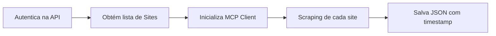
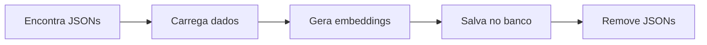

# WebScraper + Vectorizer - UniPost API

Sistema completo de **Web Scraping Inteligente** e **Vetorização Automática** utilizando MCP SDK Python e Google Gemini.

## 🤖 Funcionalidades

### WebScraper (`webscraper.py`)
- **Consulta sites de referência** através da API do projeto (modelo Sites)
- **Scraping automatizado** usando MCP SDK gratuito
- **Salva resultados em JSON** com timestamp e metadados
- **Sistema de logging completo** e tratamento robusto de erros
- **Autentica automaticamente** na API usando credenciais do Django

### Text Vectorizer (`text_vectorizer.py`)
- **Processa JSONs** gerados pelo webscraper automaticamente
- **Gera embeddings** usando Google Gemini (`embedding-001`)
- **Salva vetores** no modelo `Embedding` com `origin="webscraping"`
- **Remove JSONs** após processamento bem-sucedido
- **Chunking inteligente** para textos grandes
- **Controle de duplicatas** e sistema de logs avançado

## 📁 Estrutura

```
scraping/
├── __init__.py                 # Módulo Python
├── webscraper.py              # ✨ Web scraping com MCP SDK
├── text_vectorizer.py         # ✨ Vetorização automática com Gemini
├── scraping.log              # Log do webscraper
├── vectorizer.log            # Log do vectorizer
├── scraping_results_*.json   # 🗂️ Resultados temporários (removidos após vetorização)
└── README.md                 # Esta documentação
```

## 🚀 Instalação e Configuração

### 1. Dependências já incluídas

As dependências estão no `requirements.txt` principal:
```bash
# Já incluídos no projeto
httpx==0.27.2              # Cliente HTTP assíncrono
mcp==1.1.0                 # MCP SDK para web scraping  
google-generativeai==0.8.3 # Google Gemini para embeddings
```

### 2. Variáveis de ambiente no `.env`:

```env
# Credenciais da API (obrigatório)
DJANGO_SUPERUSER_USERNAME=seu_usuario
DJANGO_SUPERUSER_PASSWORD=sua_senha
API_BASE_URL=http://localhost:8000/api/v1

# Google Gemini API Key (obrigatório para vectorizer)
GOOGLE_GEMINI_API_KEY=sua_chave_gemini
```

### 3. Obter chave do Google Gemini

1. Acesse [Google AI Studio](https://aistudio.google.com/)
2. Crie uma conta gratuita
3. Gere uma API Key
4. Adicione no `.env`

## 📋 Como Usar

### Fluxo Completo (Recomendado)

```bash
# 1. Execute o web scraping
python scraping/webscraper.py

# 2. Processe e vetorize os dados coletados
python scraping/text_vectorizer.py
```

### Execução Individual

```bash
# Apenas web scraping (gera JSONs)
python scraping/webscraper.py

# Apenas vetorização (processa JSONs existentes)  
python scraping/text_vectorizer.py
```

## 🔄 Fluxo Detalhado

### 1. WebScraper (`webscraper.py`)



**Processo:**
1. **Autenticação**: Login na API com credenciais do Django
2. **Consulta Sites**: Busca lista de sites no endpoint `/api/v1/sites/`
3. **MCP Client**: Inicializa cliente MCP gratuito
4. **Web Scraping**: Realiza scraping usando web search
5. **Salva JSON**: Arquivo `scraping_results_YYYYMMDD_HHMMSS.json`

### 2. Text Vectorizer (`text_vectorizer.py`)



**Processo:**
1. **Busca JSONs**: Localiza `scraping_results_*.json`
2. **Processa textos**: Extrai conteúdo e aplica chunking se necessário
3. **Gera embeddings**: Usa Google Gemini para vetorização
4. **Salva banco**: Cria registros no modelo `Embedding`
5. **Cleanup**: Remove JSONs processados com sucesso

## 📊 Dados e Metadados

### JSON de Scraping (Temporário)
```json
[
  {
    "site_name": "TechCrunch",
    "site_url": "https://techcrunch.com",
    "scraped_at": "2025-01-01T10:00:00Z",
    "content": "Conteúdo do site...",
    "status": "success"
  }
]
```

### Embedding salvo no banco
```python
{
  "id": "uuid-gerado",
  "origin": "webscraping",
  "content": "Conteúdo do site...",
  "title": "TechCrunch",
  "embedding_vector": [0.123, -0.456, ...], # 1536 dimensões
  "metadata": {
    "site_name": "TechCrunch",
    "site_url": "https://techcrunch.com", 
    "category": "NOTICIAS",
    "scraped_at": "2025-01-01T10:00:00Z",
    "chunk_index": 0,
    "total_chunks": 1,
    "processed_at": "2025-01-01T10:05:00Z"
  }
}
```

## 🔍 Monitoramento e Logs

### Logs Principais

```bash
# Log do web scraping
tail -f scraping/scraping.log

# Log da vetorização  
tail -f scraping/vectorizer.log

# Logs em tempo real
tail -f scraping/*.log
```

### Verificar Resultados no Banco

```bash
python manage.py shell

>>> from embeddings.models import Embedding
>>> # Contar embeddings de web scraping
>>> Embedding.objects.filter(origin='webscraping').count()
42

>>> # Ver último embedding criado
>>> Embedding.objects.filter(origin='webscraping').latest('created_at')
<Embedding: webscraping: TechCrunch>
```

## ⚙️ Configurações Avançadas

### Chunking de Texto

O `text_vectorizer.py` divide automaticamente textos grandes:

```python
# Configuração padrão
max_chunk_length = 1000  # caracteres
overlap = 100           # sobreposição entre chunks
```

### Limite da API Gemini

```python
# Texto é limitado para evitar erros da API
max_text_length = 2048  # caracteres
```

## 🐛 Solução de Problemas

### WebScraper

1. **Erro de autenticação**: Verifique credenciais no `.env`
2. **MCP não inicializa**: Certifique-se que `npx` está instalado
3. **Nenhum site encontrado**: Cadastre sites no modelo `Site` via admin
4. **Timeout na API**: Sites podem estar offline

### Text Vectorizer  

1. **API Key inválida**: Verifique `GOOGLE_GEMINI_API_KEY`
2. **Nenhum JSON encontrado**: Execute `webscraper.py` primeiro
3. **Erro de banco**: Verifique se modelo `Embedding` foi migrado
4. **Quota excedida**: Aguarde reset da quota da API Gemini

### Logs Específicos

```bash
# Webscraper
grep "ERROR" scraping/scraping.log

# Vectorizer
grep "ERROR" scraping/vectorizer.log

# Ver estatísticas
grep "Total processado" scraping/vectorizer.log
```

## 🚀 Automação (Futuro)

### Crontab para Execução Automática

```bash
# Adicionar ao crontab (execução diária às 02:00)
0 2 * * * cd /path/to/project && python scraping/webscraper.py && python scraping/text_vectorizer.py
```

### Webhook para Sites

```python
# Futuro: Trigger automático quando novos sites são cadastrados
@receiver(post_save, sender=Site)
def trigger_scraping_on_new_site(sender, instance, created, **kwargs):
    if created:
        # Executar web scraping automaticamente
        pass
```

## 💡 Melhorias Futuras

- **Scraping incremental**: Só buscar conteúdo novo
- **Múltiplas fontes MCP**: Integrar outros provedores
- **Scheduling avançado**: Diferentes frequências por categoria
- **Análise de sentimento**: Adicionar análise aos metadados
- **Detecção de idioma**: Processar apenas conteúdo português

---

**Integrado ao sistema UniPost API 🤖 - Web Scraping + IA em perfeita harmonia!**